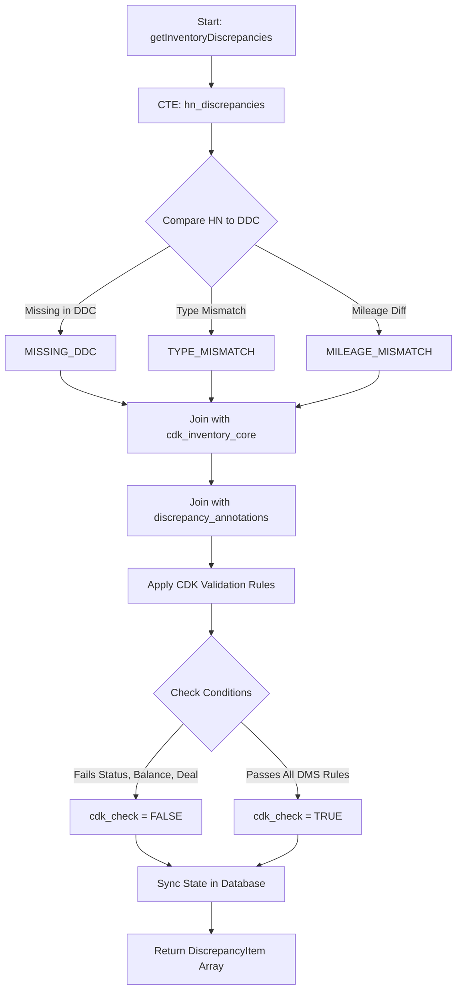
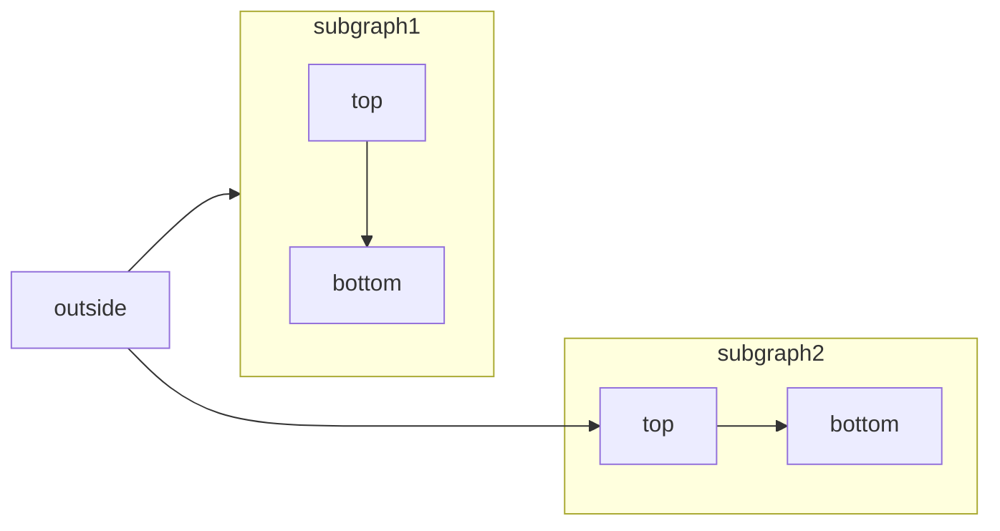

The `inventoryService` is the core orchestration layer responsible for reconciling data between the Dealership Management System (**CDK**), marketing aggregators (**HomeNet**), and consumer-facing websites (**Dealer.com**).

## System Overview

The service identifies mismatches in vehicle data (price, mileage, status) and tracks the "age" of a discrepancy. It ensures that vehicles are not only physically present but also correctly accounted for in the DMS before being marketed.

### Core Data Sources

| Source      | Role            | Description                                                |
| :---------- | :-------------- | :--------------------------------------------------------- |
| **HomeNet** | Marketing Truth | The primary source for vehicle photos and syndication.     |
| **DDC**     | Consumer Truth  | The live status of the vehicle on the dealership website.  |
| **CDK**     | Financial Truth | The accounting system containing balances and deal status. |

---

## Business Logic: The CDK Validation

The service runs a "CDK Check" to determine if a vehicle is "Clean." If any of the following rules are violated, the vehicle is flagged with a specific `cdk_issue_type`.

### Validation Rules

<Steps>
  <Step title="Stock Type Validation">
    Vehicle must be categorized as `USED`, `NEW`, or `F` (Factory).
  </Step>
  <Step title="Status Verification">
    Must be in status `S` (Stock) or `F` (Factory). Vehicles in other statuses are considered unavailable.
  </Step>
  <Step title="Deal Check">
    If a `deal_no` is present in CDK, the vehicle is considered sold and should not appear as available inventory.
  </Step>
  <Step title="Financial Balance">
    The vehicle must have a `balance > 0`. A zero balance usually indicates an accounting error or a completed sale.
  </Step>
  <Step title="Company Mapping">
    Each dealership name is mapped to a specific CDK Company Code. A mismatch flags an `INVALID_COMPANY` error.
  </Step>
</Steps>

---

## Logic Flows

### Discrepancy Detection Pipeline

This flowchart represents the `getInventoryDiscrepancies` logic, which aggregates data and applies the validation rules.



````mermaid

````